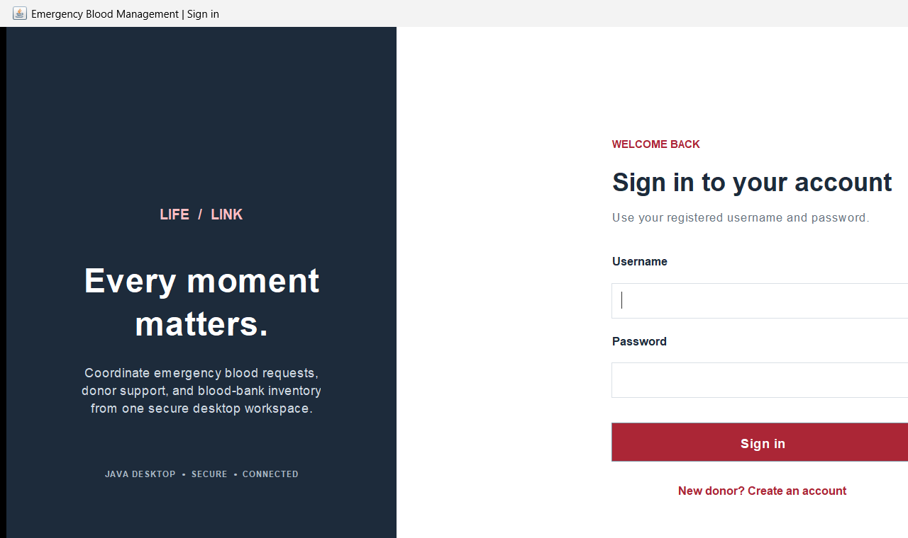

# Emergency Blood Request & Donor Matching System

A Java 17 Swing desktop application for managing blood donors, emergency requests, compatible donor screening, blood-bank inventory, and blood transfers.

> **Clinical safety:** compatibility in this project is a preliminary red-cell screening aid, not a clinical decision. Qualified medical and blood-bank staff must confirm component type, ABO/Rh compatibility, crossmatch results, and local transfusion policy before blood is issued.

## Features

- Role-based sign-in for administrators, blood-bank staff, and donors.
- Donor self-registration, donor directory, availability, account status, and donation eligibility checks.
- Emergency request creation with critical/high/medium/low priority.
- Compatible donor screening with a transparent 100-point score and city preference.
- MySQL-backed requests, donor matches, and donor notification records.
- Blood stock entry, expiry handling, low/critical stock alerts, locked reservations, issue, and cancellation.
- Transactional donation recording with donor and inventory updates.
- Hospital and blood-bank directory management.
- Blood-bank transfer request, approval, dispatch, and receipt workflows.
- CSV/TXT summary report export and administrator audit/account screens.
- PBKDF2-HMAC-SHA-256 salted password hashes; database credentials are read from environment variables.
- JUnit 5 unit tests for compatibility, eligibility, matching, validation, inventory alerts, and password hashing.

## Technology

- Java 17+
- Java Swing, JDBC, Java Collections, Streams, lambdas, and `ExecutorService`
- MySQL 8.0.16+
- Maven
- JUnit 5

No web framework, application server, ORM, or browser UI is used.

## Architecture

```text
Swing UI (LoginFrame, DashboardFrame)
                 |
             Services
     eligibility / matching / inventory
                 |
           JDBC DAO layer
                 |
        MySQL (InnoDB tables)
```

Business rules live in services; SQL is parameterized with `PreparedStatement`. Reservation, donation, and transfer dispatch/receipt operations use transactions and row locks. Emergency searches use an `ExecutorService` so database work does not block Swing's event-dispatch thread.

### Project structure

```text
src/main/java/com/bloodmanagement/
  dao/        JDBC data access
  enums/      Shared roles, blood groups, and workflow states
  exception/  Domain and persistence exceptions
  model/      Domain records
  service/    Authentication, eligibility, matching, inventory, reporting
  ui/         Swing login and role dashboards
  util/       JDBC transactions, configuration, validation, password hashing
  Main.java   Desktop entry point
src/main/resources/
  database.sql
  sample-data.sql
src/test/java/  JUnit 5 tests
```

## Donor eligibility and matching

This educational workflow applies an 18-year minimum age, active account and donor availability checks, and a 90-day minimum interval since the last recorded donation. A blood-bank should adapt eligibility rules to applicable regulations and medical screening.

The project's red-cell ABO/Rh screening map is centralized in `BloodCompatibilityService`. Matching only considers active, available, eligible donors. The score is:

| Criterion | Points |
|---|---:|
| Blood group: exact / compatible | 40 / 30 |
| Eligibility | 20 |
| Availability | 15 |
| Same city | 15 |
| Donation-history interval | 5–10 |

Matches are sorted by score. Emergency requests are ordered critical-first. Neither ranking nor these educational rules authorize a transfusion.

## Setup

Requirements: JDK 17 and MySQL 8.0.16+. The included Maven Wrapper downloads the pinned Maven release when first used.

1. Install or extract MySQL Server. On this Windows setup, the project scripts expect the official ZIP distribution in:

   ```text
   %LOCALAPPDATA%\Programs\MySQL-8.4.9\mysql-8.4.9-winx64
   ```

   For a different installation location, set `MYSQL_HOME` in PowerShell to the MySQL Server directory.

2. Start the server in a terminal and leave that terminal open. The script initializes a local data directory on first run and binds MySQL to loopback only:

   ```powershell
   powershell.exe -NoProfile -ExecutionPolicy Bypass -File .\scripts\start-local-mysql.ps1
   ```

3. In a second terminal, set up the schema, sample hospital/blood-bank stock, and a least-privilege app account:

   ```powershell
   powershell.exe -NoProfile -ExecutionPolicy Bypass -File .\scripts\setup-local-database.ps1
   ```

   The setup changes MySQL's initially empty local root password, generates a random `blood_app` password, and stores both encrypted with Windows DPAPI for the current Windows account. Neither password is printed or stored in the repository.

4. Create the first administrator with secure, non-echoing password prompts:

   ```powershell
   powershell.exe -NoProfile -ExecutionPolicy Bypass -File .\scripts\create-admin.ps1
   ```

   The Java bootstrap is also available directly if MySQL environment variables have already been configured:

   ```powershell
   .\mvnw.cmd exec:java "-Dexec.mainClass=com.bloodmanagement.util.BootstrapAdmin"
   ```

5. Run the application:

   ```powershell
   powershell.exe -NoProfile -ExecutionPolicy Bypass -File .\scripts\run-local-app.ps1
   ```

   Administrators can create blood-bank staff accounts in the Accounts screen. Donors may register from the sign-in screen. To use another deployment, set `BLOOD_DB_URL`, `BLOOD_DB_USER`, and `BLOOD_DB_PASSWORD`; credentials are never committed to source control.

6. Build and test:

   ```powershell
   .\mvnw.cmd clean test package
   ```

   The package phase also creates a runnable shaded JAR containing the JDBC driver. Set database environment variables before launching the JAR:

   ```powershell
   java -jar target\emergency-blood-request-donor-matching-1.0.0-SNAPSHOT.jar
   ```

In VS Code, open this folder, set the same environment variables in the integrated PowerShell terminal, then run the commands above. Java extensions can also launch `com.bloodmanagement.Main` with the configured environment.

## First run and sample data

The sample script creates one example hospital, one example bank, and a small sample stock lot. It does **not** create login accounts or donor records. Create the first admin with the bootstrap command; then add hospital/bank records as needed. `sample-data.sql` is idempotent for its example rows.

## Screenshot

The sign-in screen below is captured from the running Java Swing application. The role-specific workspace appears after signing in with a configured database account.



## Tests

```powershell
.\mvnw.cmd test
```

The unit tests do not need a live database. To run the MySQL workflow integration tests against the locally configured database, use:

```powershell
powershell.exe -NoProfile -ExecutionPolicy Bypass -File .\scripts\test.ps1
```

The integration tests register test donors, requests, and blood banks in the selected database. Use a disposable development database for integration tests, not production data.

## Security and privacy

- No default usernames/passwords or database credentials are committed.
- Passwords are hashed with PBKDF2-HMAC-SHA-256 and per-password random salts.
- Use a least-privileged MySQL user and protect patient/donor data in production.
- `.gitignore` excludes local IDE files, build output, logs, and `.env` files.
- This project is an engineering demonstration, not a certified clinical or blood-bank information system.

## Future production work

Before real-world use, add formal authorization policy enforcement and staff verification workflows, secure transport and key management, backups, data-retention controls, complete operational reporting, accessibility/usability testing, and independent clinical, security, and regulatory review.
